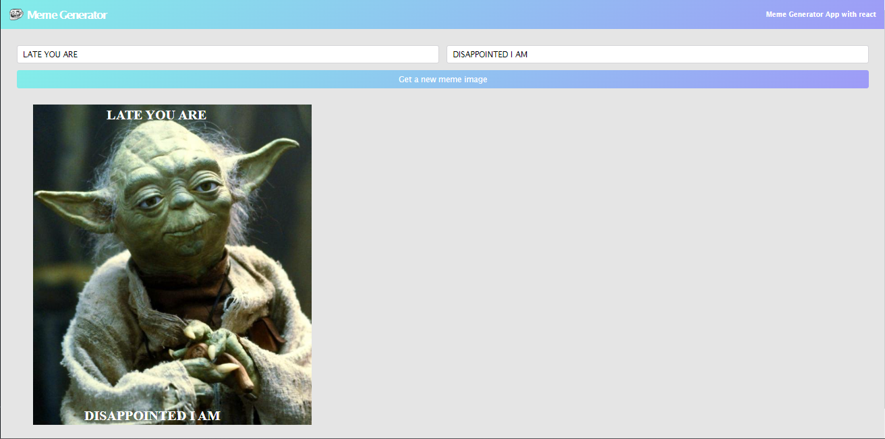

# Meme Generator

 
 

<table>
  <tr>
    <td></td>
  </tr>
</table>
 

 

<b>A react app for generating memes</b>

 

## ➡️ Description
This is an app for generating memes built in react 
Built this app while learning react for web development 

The app is able to generate memes with text distributed at the top and bottom
  

## ➡️ Languages | Technologies

<table>
  <tr>
    <td>Programming Languages</td>
    <td>Javascript</td>
  </tr>
  <tr>
    <td>Frameworks</td>
    <td>React</td>
  </tr>
</table>
 

## ➡️ Installation
* Clone or download this repository
* Ensure you have nodejs and npm installed on your system
* Inside the project repository, run the command **npm install**
* Run **npm start**
* Enjoy the app

## ➡️ Contribution/Improvement
* To improve on this, a download button should be added to download image
